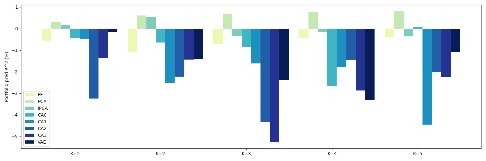

# Reimplementation: Autoencoder Asset Pricing Models

### 这是北京某高校2024-2025春季学期hxl和zw老师《深度学习与金融数据分析》课程的期末project，完成了对《Autoencoder Asset Pricing Models》的代码复现，并尝试引入了VAE模型，更好的完成资产定价任务。

co-workers：wyh and wzy

## Implemented Models


| Category  | Identifier   | Description                                          |
| --------- | ------------ | ---------------------------------------------------- |
| Classical | **FF**       | Fama‑French regression on pre‑defined factors      |
| Classical | **PCA**      | Principal Component Analysis on portfolio returns    |
| Classical | **IPCA**     | Instrumented PCA (Kelly, Pruitt & Su, 2019)          |
| Neural    | **CA\_wyh**  | Characteristic Auto‑Encoder (Gu, Kelly & Xiu, 2020) |
| Neural    | **VAE\_wyh** | Variational Auto‑Encoder variant of*CA\_wyh*        |
| Neural    | **VAE\_wzy** | Alternative VAE specification                        |

---

## Directory Layout

```text
├── analysis.py          # Compute R², α and other evaluation metrics
├── data_prepare.py      # Raw CRSP/Compustat→ feature matrix
├── main_wyh.py          # Unified training / inference entry‑point
├── utils.py             # Constants & common helpers
│
├── data/                # Raw & intermediate data (generated)
├── models/              # Model definitions
│   ├── modelBase.py     # Sliding‑window backbone class
│   ├── FF.py            # Fama‑French
│   ├── PCA.py           # Principal Components
│   ├── IPCA.py          # Instrumented PCA
│   └── CA_wyh.py        # Characteristic Auto‑Encoder, VAE models
│
├── results/             # CSV outputs (generated at run‑time)
└── imgs/                # Visualisations (auto‑generated)
```

---

###total $R^2$


###pred $R^2$ 


## Quick Start

1. **Install Dependencies**

   ```bash
   pip install -r requirements.txt
   ```
2. **Prepare Data**

   ```bash
   python data_prepare.py
   ```
3. **Run a Model** (example: 5‑factor *CA\_wyh*)

   ```bash
   python main_wyh.py --model CA_wyh --K 5
   ```

   Outputs land in `results/` and graphics in `imgs/`.

## CA\_wyh at a Glance

The Characteristic Auto‑Encoder learns asset exposures (β) and factor returns (f) jointly via two neural networks:


| Component   | Shape             | Default Hyper‑parameters       |
| ----------- | ----------------- | ------------------------------- |
| `ca_beta`   | 94 →*K*          | Hidden‑layers:`[32, 16]`, ReLU |
| `ca_factor` | 94 →*K*          | Linear                          |
| Loss        | \|R − β fᵀ\|² | `MSELoss`                       |
| Optimiser   | —                | Adam,`lr=1e‑3`                 |

Early‑stopping with a 5‑epoch patience is enabled by default. Checkpoints are stored in `saved_models/`.

---
